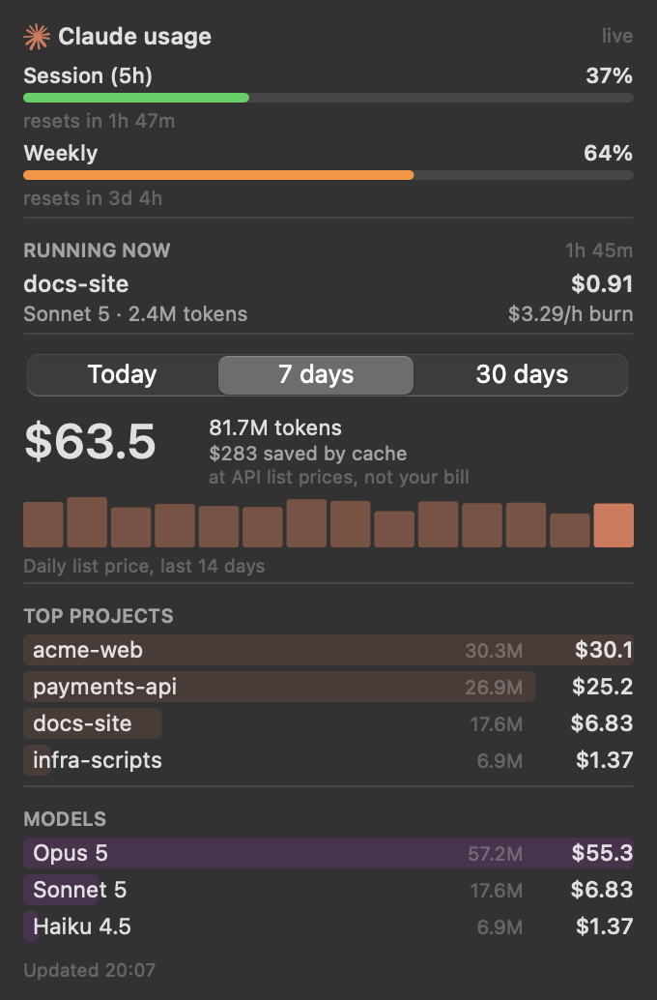

# Claude Usage Bar

A macOS menu bar tracker for Claude Code: how much of your subscription window is left,
and what your usage would cost at API list prices. Click the spark for the full report.



*(Screenshot rendered from synthetic data — `scripts/preview.py --demo`.)*

## What it shows

| Section | What it answers |
|---|---|
| Session (5h) / Weekly | How much of the subscription quota is used, and when it resets |
| Running now | The session writing to a log right now: project, model, cost, burn rate per hour |
| Today / 7 days / 30 days | Cost and tokens for the window, with a 14-day daily-cost sparkline |
| Top projects | Which repos the spend went to |
| Models | Opus / Sonnet / Haiku split, and what prompt caching saved |

The menu bar label shows the 5h quota by default; the menu switches it to the weekly
quota, today's cost, or the icon alone, and toggles the icon between monochrome and
Claude's coral.

Every dollar figure is the **API list price** of the tokens used, not a bill: on a
subscription you pay a flat fee, so read it as "what this usage would cost
pay-as-you-go".

## Requirements

- macOS 13 or later
- Python 3.9+ (the system `/usr/bin/python3` is fine; it needs the Xcode Command Line
  Tools, which `xcode-select --install` provides)
- Claude Code, with at least one session already logged

## Install

```bash
git clone https://github.com/Gr0mar/claude-usage-bar.git
cd claude-usage-bar
./scripts/setup.sh
open -a ClaudeUsageBar
```

`setup.sh` builds a virtualenv, runs the tests, and calls `install.sh`; `install.sh`
alone rebuilds the runtime and the app bundle, which is what you run after changing the
code.

The install puts the runtime under `~/Library/Application Support/ClaudeUsageBar` and
the bundle at `/Applications/ClaudeUsageBar.app`. That split is deliberate: an app
launched from Finder cannot read `~/Desktop` or `~/Documents`, so a bundle pointing back
at a checkout there would die on startup.

**macOS will ask once for keychain access.** That is the OAuth token read described
below. Deny it and everything still works — the app falls back to the statusline file or
to a local token count.

"Launch at login" in the menu writes a LaunchAgent to `~/Library/LaunchAgents` — no
admin rights, no installer.

## Where the numbers come from

**Spend** is read from the session logs Claude Code already writes to
`~/.claude/projects/**/*.jsonl`. Each assistant response carries a `usage` block; those
tokens are priced against a table of published per-million rates — list prices, which is
why the totals dwarf a subscription fee. A model with no published price still has its
tokens counted and is shown as `—` rather than guessed at. Nothing leaves your machine
to compute this.

**Quota windows** come from one of two places, whichever answers first:

1. `https://api.anthropic.com/api/oauth/usage`, called with the OAuth token Claude Code
   stores in your login keychain. The token is read for that single request; it is never
   written to disk or logged, the request refuses redirects so the header cannot be
   replayed to another host, and it goes to Anthropic and nowhere else.
2. `~/.claude/usage-bar/limits.json`, written by the bundled statusline hook. No
   credentials at all, but it only refreshes while a Claude Code session is running.

If neither answers, the header falls back to a local count of the tokens billed in the
last five hours and says so. The endpoint rate-limits, so it is polled every five
minutes and backs off to half-hourly after a failure; a reading older than five minutes
is shown with its timestamp rather than as current.

### Optional: the statusline hook

Claude Code pipes a JSON blob into your statusline command on every turn, and for
subscribers it contains the quota windows. `scripts/statusline-limits.sh` saves them and
then hands the untouched input to whatever statusline command you already use:

```json
"statusLine": {
  "type": "command",
  "command": "/path/to/claude-usage-bar/scripts/statusline-limits.sh 'your existing command'"
}
```

With no argument it prints a small `5h 42% · 7d 8%` line of its own.

## Accuracy

Claude Code writes one log line per content block, and every line of the same response
repeats the same message id and the same complete `usage` object — often seconds apart,
so a response routinely straddles two scans. The scanner therefore remembers every event
id it has already counted; without that, roughly a third of all responses would be
counted twice. The same set makes re-reading a file idempotent, so a `/rewind`, a
rotation, or a full rescan cannot inflate the totals.

## Performance

The first launch parses every log once and caches the day-level rollup in
`~/Library/Caches/com.github.gr0mar.ClaudeUsageBar`. After that each pass reads only the bytes
a log has grown by, tracked per file, and a half-written trailing line is left for the
next pass rather than dropped. Idle cost is one `stat` per log every five seconds; the
directory tree itself is re-walked at most once a minute.

## Uninstall

```bash
rm -rf /Applications/ClaudeUsageBar.app
rm -rf ~/Library/Application\ Support/ClaudeUsageBar
rm -rf ~/Library/Caches/com.github.gr0mar.ClaudeUsageBar
launchctl bootout gui/$(id -u)/com.github.gr0mar.ClaudeUsageBar 2>/dev/null
rm -f ~/Library/LaunchAgents/com.github.gr0mar.ClaudeUsageBar.plist
defaults delete com.github.gr0mar.ClaudeUsageBar 2>/dev/null
rm -rf ~/.claude/usage-bar
```

## Development

```bash
.venv/bin/python -m unittest discover -s tests   # no network, no display, no keychain
.venv/bin/python scripts/preview.py /tmp 7       # renders the dropdown to PNGs
.venv/bin/python scripts/preview.py docs 7 --demo  # the README screenshot, synthetic data
./scripts/run.sh                                 # foreground, prints tracebacks
```

The app's identity - bundle id, cache directory, LaunchAgent label - lives in
`claude_usage_bar/identity.py`, and the install script reads it from there.

`claude_usage_bar/` splits into pure logic (`parser`, `pricing`, `aggregate`, `scanner`,
`live`, `limits`, `formatting`, `store`) and the AppKit layer (`ui/`). Only `ui/` imports
AppKit; everything else is testable without a display. The store owns one background
thread that publishes an immutable snapshot, and the UI reads that snapshot once per
layout pass — so a repaint can never mix values from two different scans.

PRs welcome; run the tests before opening one.

## Licence

MIT — see [LICENSE](LICENSE).
